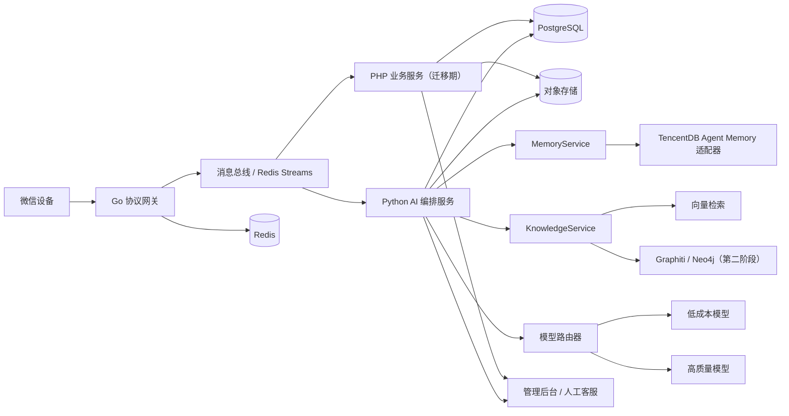

# 系统架构基线

状态：建议方案，尚未实现
最后更新：2026-08-18

## 架构目标

- 把设备长连接与业务、模型供应商解耦。
- 支持从现有 PHP 系统渐进迁移，而不是一次性替换。
- 保证消息可追溯、处理幂等、服务可降级、费用可计量。
- 允许不同 AI、记忆和知识图谱实现通过适配器替换。

## 逻辑结构

## 核心数据流

1. Go 网关接收设备帧，验证长度、消息类型、身份和速率限制。
2. 网关把原始消息元数据与标准化事件写入消息总线，使用消息 ID 作为幂等键。
3. 业务服务保存会话、客户和任务状态；AI 服务只消费获得授权的会话内容。
4. 模型路由器先调用低成本模型，按置信度、风险和业务价值决定是否升级。
5. 回复通过业务策略审核后进入出站队列，再由网关发给对应设备。
6. 原始记录、模型调用、记忆变化和最终回复保留关联 ID，支持审计与回放。

## 服务边界

| 服务 | 负责 | 不负责 |
|---|---|---|
| Go 协议网关 | TCP、帧、Protobuf、鉴权、连接、收发、限流 | 客服策略、提示词、长期记忆 |
| PHP 业务服务 | 现有业务规则、账号、会话、后台、迁移期兼容 | 直接持有设备长连接 |
| Python AI 服务 | 分类、检索、模型路由、记忆抽取、批处理 | 业务最终权限判断、设备协议 |
| MemoryService | 记忆写入、查询、删除、版本和来源 | 客户回复生成 |
| KnowledgeService | 文档检索、引用、图谱查询 | 保存权威业务交易状态 |
| 对象存储 | 加密保存媒体、附件和大对象，执行租户权限与生命周期策略 | 连接状态、消息索引、业务事务 |

## 可靠性原则

- 入站、出站和模型任务分别使用可重试队列。
- 以 `message_id`、`task_id`、`model_call_id` 建立端到端追踪。
- 对设备发送采用 outbox/ack 状态机，避免服务重启后重复或丢失。
- AI 不可用时允许人工接管或规则回复，不能阻断原始消息入库。
- 首个生产版本至少部署两个网关实例，避免单点故障。

## 分阶段实现

1. 协议恢复与 Go 网关最小闭环。
2. 标准消息模型、存储、队列和现有 PHP 适配。
3. AI 分类与建议回复，默认人工确认。
4. 记忆服务、知识检索和低风险自动回复。
5. 知识图谱、精细路由、质量评估和规模化容灾。
